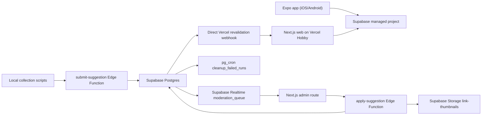

# Deployment

The MVP uses only managed free-tier services and static hosting.

| Piece | Runtime | Paid server? |
|---|---|---|
| Database, Auth, Realtime, Storage | Supabase managed free tier | No |
| Local article/video collection | Developer machine with `yt-dlp` and Ollama | No |
| Moderation intake/apply functions | Supabase Edge Functions | No self-managed server |
| Cron cleanup | `pg_cron` inside Supabase | No |
| Public web and admin | Vercel Hobby Next.js | No self-managed server |
| Mobile app | Expo / EAS free tier | No |

The cloud collection functions remain dormant in the repo for a later deployed-agent mode. Revalidation is a single direct path: the database trigger calls the Vercel `/api/revalidate` endpoint from Vault-configured secrets.

If Vercel is excluded, the public app can be exported as static pages and hosted on Cloudflare Pages or GitHub Pages; on-demand revalidation would become rebuild-on-approval.
