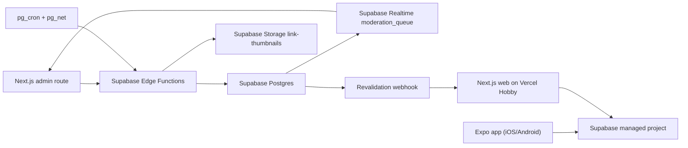

# Deployment

The MVP uses only managed free-tier services and static hosting.

| Piece | Runtime | Paid server? |
|---|---|---|
| Database, Auth, Realtime, Storage | Supabase managed free tier | No |
| Agent functions | Supabase Edge Functions | No self-managed server |
| Cron and HTTP enqueue | `pg_cron` + `pg_net` inside Supabase | No |
| Public web and admin | Vercel Hobby Next.js | No self-managed server |
| Mobile app | Expo / EAS free tier | No |

If Vercel is excluded, the public app can be exported as static pages and hosted on Cloudflare Pages or GitHub Pages; on-demand revalidation would become rebuild-on-approval.
