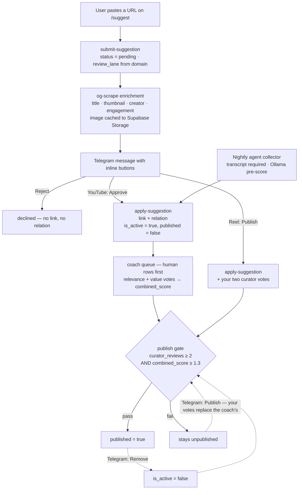

# Telegram Ops Bot — Research & Implementation Plan

> Status: planned (2026-08-14). Owner: founder. Tracking tasks: **M103**-**M110**, **MI38**-**MI40** in [`tasks.md`](../tasks.md); overlaps and extends existing **M46** (admin takedown), **M98** (non-YouTube enrichment), **M99** (transcript backfill).
> Goal: a private Telegram bot that reports product events in near-real time (installs, registrations/sign-ins, saves/watched, link submissions) and lets the founder post-moderate straight from the chat — **remove** a link that is irrelevant, and **publish** one that was rejected but is actually good.

## 1. Executive summary

All requested live product events now have a durable Postgres source. The install-ish signal is not a store install or first launch; it is the lazy anonymous Auth user minted by the first meaningful app action in M120.

Recommended shape:

```
Postgres triggers ──▶ public.telegram_outbox ──▶ pg_cron (1 min)
                                                     │
                                                     ▼
                                       Edge Function `telegram-notify`
                                                     │  sendMessage (+ inline buttons)
                                                     ▼
                                            Telegram private group
                                                     │  callback_query ("Remove")
                                                     ▼
                                       Edge Function `telegram-webhook`
                                                     │  moderate_remove_relation()
                                                     │  moderate_publish_relation()  (founder curator vote)
                                                     ▼
                                 link_skill_relations → trg_lsr_revalidate → Vercel ISR
```

Why an outbox instead of triggers posting directly with `pg_net` (the `notify_revalidation()` pattern in [`0002_revalidation_and_cron.sql`](../supabase/migrations/0002_revalidation_and_cron.sql:29)): `pg_net` is fire-and-forget. The response lands in `net._http_response` asynchronously, so the trigger never learns Telegram's `message_id`. Without `message_id` the bot cannot edit a message after its button is pressed, which is exactly what the post-moderation flow needs. The outbox also gives retries, deduping, digesting, and an audit trail for free — and it keeps unbounded per-row HTTP calls out of write transactions on tables the nightly collector hammers.

The two moderation buttons — **Remove** and **Publish** — are mirror images acting on the same `link_skill_relations` row, and neither needs to bypass the publish gate: Remove flips `is_active`, and Publish writes a real founder curator vote that satisfies the gate's own conditions (§5.3). One `voter` column on `curator_votes` is the only schema addition.

A second pass over the architecture (§6, prompted by "what about a user-submitted TikTok or Reel?") found the more consequential problem: **the human-submission path bypasses human moderation entirely** and non-YouTube submissions arrive with every metadata field NULL. Missing transcripts are *not* what blocks them — TikTok has zero transcripts and publishes at twice the YouTube rate. Fixing that path is a prerequisite worth doing bot or no bot, and it makes the bot's best message an Approve/Reject decision rather than an after-the-fact alert.

Effort estimate: **~2–3 focused days** for events 2–5 plus both moderation buttons; no install-ping client work after `M120` because anonymous auth provides the live first-action signal; **+1 day** for the §6 prerequisite track. Zero new hosting cost — everything runs on primitives already installed in the hosted project.

## 2. What the product is (grounding)

Subskills (`xyz.subskills.app`, https://subskills.xyz) is a learning-resource aggregator: **category → sub-skill → external links** (mostly YouTube). An agent pipeline collects candidates nightly on the founder's laptop and submits them through the `submit-suggestion` Edge Function; AI coach votes plus user votes feed `combined_score`, and a publish gate (`refresh_relation_publish_gate`, cron every 15 min) makes a relation publicly visible only at `curator_reviews >= 2` and `combined_score >= 1.3`. Surfaces: Next.js web on Vercel (public catalog + `/admin` moderation queue), Expo mobile app (iOS/Android), hosted Supabase (`vqxsaabskkkjdljxiyqi`) as the single source of truth.

Verified live in the hosted database on 2026-08-13 (read-only introspection):

| Fact | Value | Why it matters here |
|---|---|---|
| `pg_net` | v0.20.3 installed | Outbound HTTP from Postgres is available |
| `pg_cron` | v1.6.4, 3 jobs scheduled | The dispatcher can be a cron job, no new host |
| `supabase_vault` | v0.3.1, `get_vault_secret()` helper in use | Bot token storage matching existing convention |
| Trigger on `auth.users` | `on_auth_user_create_contributor_profile` exists | Triggers on the `auth` schema demonstrably work in hosted |
| `auth.users` | **1** | Auth events will be rare — per-event messages are fine |
| `user_bookmarks` / `user_watched` | **7** / **5** | Engagement events are rare today |
| `suggestions` total | **10,862** | ⚠️ see §4.4 |
| `suggestions` where `origin_type='human'` | **3** | The only ones a human submitted |
| `links` active | 7,420 | Scale of the catalog the removal button acts on |

The mobile app is **not yet in either store** — [`docs/mobile-store-submission-checklist.md`](mobile-store-submission-checklist.md) is entirely unchecked and notes the Apple Developer Program account is not yet purchased. That single fact decides the install-tracking design (§4.1).

## 3. Event sources — where each one actually lives today

| Requested notification | Source of truth today | Trigger point |
|---|---|---|
| New install-ish signal | `auth.users where is_anonymous` | Anonymous first action; not store install / first launch |
| New registration | `auth.users` INSERT | `AFTER INSERT ON auth.users` |
| New sign-in | `auth.users.last_sign_in_at` | `AFTER UPDATE OF last_sign_in_at ON auth.users` |
| Saved a video | `public.user_bookmarks` INSERT (via `set_user_bookmark`, [`0025`](../supabase/migrations/0025_community_actions_and_coach_security.sql:458)) | `AFTER INSERT ON user_bookmarks` |
| Marked watched | `public.user_watched` INSERT (via `set_user_watched`, [`0025`](../supabase/migrations/0025_community_actions_and_coach_security.sql:520)) | `AFTER INSERT ON user_watched` |
| New link submission | `public.suggestions` INSERT, `origin_type='human'` | `AFTER INSERT ON suggestions` **filtered** |
| Remove irrelevant link | `link_skill_relations.is_active` / `links.is_active` soft delete | New `moderate_remove_relation()` RPC called from the webhook |
| Publish a rejected link | `curator_votes` → `combined_score` → the publish gate | New `moderate_publish_relation()` RPC casting a founder curator vote (§5.3) |

## 4. Per-event design and the traps in each

### 4.1 New installs — superseded by anonymous first-action identity

**There is no realtime install feed from either store, and there won't be one.**

- Apple: the [Analytics Reports API](https://developer.apple.com/help/app-store-connect-analytics/overview/analytics-reports-api) delivers an *App Installs & Deletions (Daily)* report, but an ONGOING request only starts producing files ~24–48 h later and a day's data is complete at **D+2**. It also requires an active Apple Developer account, which this project does not have yet.
- Google: the [Play Developer Reporting API](https://developers.google.com/play/developer/reporting/metricset-intro) is vitals-oriented and has no install metric set; install statistics come from the daily CSV exports in the Play Console's Cloud Storage bucket.

So a store-sourced install alert would be a **daily digest of two-day-old numbers**, and impossible before release. The closed-testing release deliberately does **not** add `app_installs`, `track-install`, or an MMKV install id. `M120` makes the useful live signal almost free: the first meaningful app action creates a Supabase anonymous Auth user, so `auth.users where is_anonymous is true` approximates first actions.

Honest caveats to accept and state in the message copy:
- This counts **first actions, not store installs or first launches**. A user who only opens and browses mints no row.
- Anonymous auth has its own per-IP rate limit and should still be treated as directional, not an audited install feed.
- Optional later: a weekly digest job pulling the real Apple/Play numbers once the developer accounts exist, posted alongside the live counter so the two can be sanity-checked against each other.

### 4.2 Registrations and sign-ins

Registration is `AFTER INSERT ON auth.users` — safe, and precedented: the project already runs `on_auth_user_create_contributor_profile` on that exact table in hosted.

Sign-in is the subtler one. Options considered:

| Option | Verdict |
|---|---|
| Trigger on `auth.sessions` INSERT | Works in principle but the `auth` table ownership (`supabase_auth_admin`) makes it less certain than `auth.users`; also fires on some refresh paths |
| Supabase Auth Hook — *Custom Access Token* | Fires on **every** token refresh (hourly per active client). Far too noisy |
| **Trigger on `auth.users` UPDATE OF `last_sign_in_at`** | ✅ Recommended. GoTrue stamps this on a real sign-in, not on refresh; same table whose trigger privileges are already proven |
| Client-side ping | Rejected — spoofable, and duplicates state the DB already has |

Message should distinguish provider (`raw_app_meta_data->>'provider'`: email magic link / google / apple) and flag first-ever sign-in vs returning.

### 4.3 Saves and watched

Both write through SECURITY DEFINER RPCs that are **authentication-gated on every surface** — web [`useResourceActions.ts:116`](../apps/web/lib/useResourceActions.ts:116) and mobile `ResourceCard.tsx` both call `requireSignedIn()` first. Consequences:

- Every save/watched **is** a row, so a trigger catches 100 % of them. No client work.
- Anonymous mobile users who "save" into MMKV produce **no row and no notification**. With 1 registered user total, near-term traffic here is essentially the founder's own testing — worth an env flag to mute events whose `user_id` is in an ignore list.
- Enrich the message by joining through `link_skill_relations → links, skills, categories` so it reads "Saved *Backhand clear drill* in Badminton → Backhand clear", not a bare UUID.

Un-saving and un-watching are DELETEs. Recommend notifying on INSERT only; a delete event is noise at this volume.

### 4.4 New link submissions — the highest-risk trigger in the set

⚠️ **`suggestions` holds 10,862 rows and only 3 of them are human.** The nightly collector inserts hundreds of agent rows per run through the same table. A naive `AFTER INSERT ON suggestions` trigger would fire hundreds of Telegram messages per night, blow through the 20-messages-per-minute group limit, and get the bot 429'd.

The trigger must be `WHEN (new.origin_type = 'human')` — enforced in the trigger's `WHEN` clause, not just in the function body, so agent inserts never even call the function during collection transactions.

Second thing to know: **human `LINK_ADD` submissions are already auto-applied.** [`submit-suggestion/index.ts:361`](../supabase/functions/submit-suggestion/index.ts:361) calls `apply-suggestion` inline for any signed-in human `LINK_ADD`, so by the time you read the Telegram message the link row and the relation row exist. This is precisely why the request is framed as *post*-moderation. It is not yet publicly visible, though — a fresh relation is `published=false` and only the publish gate can flip it (`curator_reviews >= 2` and `combined_score >= 1.3`). So there are two candidate notification moments:

- **On submission** (recommended): earliest possible signal, and removal happens before the public ever sees it.
- **On publish** (`link_skill_relations` UPDATE where `published` false→true): "this just went live". Genuinely useful too, and cheap to add as a second event kind later.

The submission message should carry title, canonical URL, target category → sub-skill, submitter display name (`contributor_profiles`), and the buttons described in §5.

## 5. Post-moderation: "Remove" and "Publish"

Two mirror-image decisions on the same object (a `link_skill_relations` row): kill something the pipeline let through, and rescue something the pipeline rejected. Both need an inbound endpoint. Telegram cannot long-poll into this stack (there is no always-on process — collection runs on the founder's laptop), so it must be a **webhook**.

**Endpoint.** A Supabase Edge Function `telegram-webhook`, deployed with gateway JWT verification disabled — the same posture `apply-suggestion` already runs with, per the README. (A Vercel route would also work and has `revalidatePath` on hand, but revalidation happens automatically here — see below — so keeping it next to the other functions is tidier.)

### 5.1 Remove

**Message layout** for a human submission:

```
🔗 New submission — Badminton › Backhand clear
"How to hit a proper backhand clear"  youtube.com/watch?v=…
by @serhii · pending publish gate

[ 🗑 Remove ]  [ 👁 Open ]  [ ✅ Keep ]
```

`callback_data` is capped at **64 bytes**; `rm:<uuid>` is 39 — comfortable. Encode the *relation* id rather than the suggestion id so the same button works for agent-collected links later.

**On press**, the webhook must:

1. Verify the `X-Telegram-Bot-Api-Secret-Token` header equals the `secret_token` passed to `setWebhook` (Telegram's built-in webhook authentication — 1–256 chars, `A-Z a-z 0-9 _ -`). Reject otherwise, 200 with no action.
2. Verify `callback_query.from.id` is in an allowlist (`TELEGRAM_ADMIN_IDS`) **and** `chat.id` matches the configured chat. A leaked chat invite must not equal moderation rights.
3. Call `answerCallbackQuery` within a couple of seconds so the client's spinner clears.
4. Call a new `moderate_remove_relation(p_relation_id uuid, p_actor text, p_reason text)` RPC (service_role only).
5. `editMessageText` on the original message to strike it and append "removed by @x at 14:22", removing the keyboard so it cannot be double-pressed.

**What removal should do** (mirrors the existing `LINK_DETACH_SKILL` branch of `apply_suggestion_transaction`, [`0008:435`](../supabase/migrations/0008_public_contributors_and_suggestions.sql:435)):

```sql
-- inside moderate_remove_relation()
update link_skill_relations set is_active = false, published = false, updated_at = now() where id = p_relation_id;
-- deactivate the link when no active relation remains
-- mark the originating suggestion 'declined' (this also decrements
--   contributor_profiles.accepted_count via sync_contributor_accepted_count)
-- insert an audit row into telegram_moderation_actions
```

Two behaviours you get for free and should not re-implement:
- **Revalidation is automatic** — `trg_lsr_revalidate` fires `after insert or update on link_skill_relations` and posts to the Vercel `/api/revalidate` endpoint, so the public page refreshes itself.
- **Contributor credit reverses automatically** — the `approved → declined` status transition decrements `accepted_count`.

Setting `published = false` inline matters: without it the row stays publicly visible for up to 15 minutes until the publish-gate cron notices `is_active = false`.

**Removal is already durable against the nightly collector — no blocklist needed.** `loadKnownCanonicalUrls(skillId)` ([`run-collection.mjs:980`](../scripts/run-collection.mjs:980)) builds the per-skill "already seen" set from *all* links joined to relations for that skill **unioned with all `LINK_ADD` suggestion payloads for that skill**, with no `is_active` and no `status` filter. A soft-deleted relation and its originating suggestion both stay in that set forever, so the collector skips the URL on every future run. The one gap is by design: the same video can still be collected for a *different* sub-skill, where it may genuinely belong.

### 5.2 Publish a rejected link

⚠️ **A naive `update link_skill_relations set published = true` is reverted within 15 minutes.** `refresh_relation_publish_gate` runs on a `*/15` cron and unpublishes every relation where `curator_reviews >= 2 AND combined_score < 1.3` ([`0025`](../supabase/migrations/0025_community_actions_and_coach_security.sql:623)). Publishing has to go *through* the gate's conditions, not around them.

Current shape of the reject pile in hosted (2026-08-13):

| Bucket | Rows | Recoverable from Telegram? |
|---|---|---|
| `is_active`, unpublished, **coach-reviewed and below the bar** | **3,824** | ✅ the main target |
| `is_active`, unpublished, not yet reviewed (`curator_reviews < 2`) | 4,861 | ✅ same mechanism |
| `suggestions.status = 'declined'` (admin queue) | 13 | ✅ re-apply, then vote |
| Dropped by the collector before submission | 42–247 **per night** | ❌ never entered the DB — see §5.4 |

### 5.3 The founder votes as a third curator (supersedes the earlier override design)

An earlier draft of this plan proposed a `moderation_override` column that the publish gate would skip. **That was over-built.** Everything it did is achievable by having the founder's tap write a real curator vote, which satisfies the gate's existing conditions instead of bypassing them.

`set_curator_vote(relation, role, weight, comment_internal, comment_public)` already exists, upserts on `unique (link_skill_relation_id, coach_role)`, and is service-role only ([`0018`](../supabase/migrations/0018_curator_votes_rpc.sql:192)). Two calls — one `relevance`, one `value` — cause everything else to fall out automatically:

| Field | How it moves | Why no override is needed |
|---|---|---|
| `relevance_vote`, `value_vote` | written by `set_curator_vote` | the only writable inputs in the whole scoring chain |
| `curator_reviews` | **generated column** — `(relevance_vote is not null) + (value_vote is not null)` | reaches 2, satisfying the gate's review condition |
| `combined_score` | `refresh_relation_scores` recomputes `relevance + value + user_score` | your weights set the score on the same scale the coach uses |
| `published` | the gate publishes on its next tick | one rule for every row, no exceptions |

Four things this collapses:

1. **No new column, and no change to `refresh_relation_publish_gate`.** The gate keeps a single rule for everything in the catalog.
2. **The ranking problem dissolves.** Your vote weights *are* the score, so no `baseline_score`, no second sort tier, no value that a later recompute can wipe. Vote 1.5 / 1.5 and the row ranks at 3.0 honestly.
3. **The row leaves the coach queue by itself.** `get_unscored_for_coach` filters `not exists (curator_votes for this role)`, so once both roles are voted the coach skips it — no wasted tokens, and the coach cannot later overwrite your call.
4. **"Publish a rejected link" needs no separate mechanism.** `set_curator_vote` upserts per role, so you *replace* the coach's vote rather than bypassing it — which is the honest semantics of disagreeing with a judgment.

Two things it does require:

- **Attribution.** `curator_votes` has no "who voted" column, so a founder vote would be indistinguishable from the AI coach's — which would quietly destroy any later measurement of coach accuracy. Add one column: `voter text not null default 'coach'` (values `coach` / `founder`). One column instead of three, and it earns its keep.
- **An inline gate call** so publishing is instant rather than up to 15 minutes late. Precedent exists: `set_user_vote` already ends with `perform public.refresh_relation_publish_gate(2, 1.3, false)`.

**The one case a vote cannot cover:** `combined_score` includes `user_score`, so enough community downvotes can drag a founder-published row back under 1.3 and the gate will unpublish it. At one registered user this is theoretical, and "the community sank it" is defensible behaviour. Revisit only if it ever actually happens.

**Removal needs no override either.** `is_active = false` already forces the gate's unpublish branch. One interaction to handle, though: if removal also sets the suggestion to `declined` (to reverse contributor credit), that frees the `LINK_ADD:<canonical_url>:<target_skill_id>` dedupe key — the unique index only covers `pending/approved/auto_approved` — so the same URL could be re-submitted and resurrected by `apply_suggestion_transaction`'s `is_active = true` upsert. Fix it at submit time by checking for an existing inactive relation, not with a `force_removed` flag.

### 5.4 What a Publish button cannot reach

Videos with no captions are dropped by the collector at [`run-collection.mjs:2870`](../scripts/run-collection.mjs:2870) (`candidate_skipped_no_transcript`, "Transcript missing or too short") **before** anything is submitted — 42, 78 and 247 of them on the last three nights. They produce no suggestion, no link, no relation; they exist only as debug lines in `.collection/logs/nightly-*.log`. A `link_transcripts` backfill keeps the in-DB gap tiny (only **2** active YouTube links currently lack a transcript), which is exactly why the caption-less cases are the ones *outside* the database.

Reaching those from Telegram is a separate, larger piece of work — the collector would have to persist skipped candidates (a `collection_rejects` table) before any button could act on one. Notifying per skip is not an option at 42–247/night. If this bucket turns out to be what matters, the cheap version is a **nightly digest**: one message listing the N highest-title-relevance caption-less drops with a Submit button that posts them through `submit-suggestion` with the internal token.

## 6. Architecture review: the human-submission path is the real problem

Prompted by "what happens to a user-submitted TikTok or Instagram reel?" — traced end to end. The premise that a missing transcript causes rejection turns out to be false; the actual failure is different, and worse.

### 6.1 Missing transcripts do not cause rejection — the data says the opposite

`get_unscored_for_coach` **LEFT JOINs** `link_transcripts` and passes `transcript: null` through ([`0031`](../supabase/migrations/0031_cloud_queue_sizing.sql:72)); nothing filters on transcript presence. The coach routine handles it explicitly: *"without one the signal is thin (title/caption + engagement) — be calibrated, not overconfident."*

Hosted numbers, active relations, 2026-08-13:

| Source | Relations | Transcripts | Published | Publish rate | Avg `combined_score` |
|---|---|---|---|---|---|
| YouTube | 11,755 | ~all | 3,159 | **27 %** | 0.24 |
| TikTok | 133 | **0** | 65 | **49 %** | **0.90** |

The entire TikTok corpus has zero transcripts and publishes at nearly twice the YouTube rate, scoring ~4× higher on average. (Partly because internal TikTok collection pre-filters hard on `engagement_authority`.) Transcript-less content is not the problem.

### 6.2 The actual problem: non-YouTube submissions arrive with no metadata at all

Both clients submit **only a URL** — `SuggestForm` sends `url`, `public_note`, `skill_level`, `target_skill_id` and nothing else. `apply-suggestion` backfills the rest via YouTube oEmbed, then bails:

```ts
const videoId = youtubeVideoIdFromUrl(payload.canonical_url) ?? youtubeVideoIdFromUrl(payload.url);
if (!videoId) return; // non-YouTube: no keyless metadata source, leave it to the collector
```
[`apply-suggestion/index.ts:243`](../supabase/functions/apply-suggestion/index.ts:243)

So a user-submitted TikTok or Reel becomes a link row with `title`, `description`, `thumbnail_url`, `duration_seconds`, `creator_handle` and all engagement counts **NULL**, `preview_status = 'pending'`, and no transcript. The coach then receives a queue row containing a URL and a sub-skill name — nothing to judge. That is what starves it, not the transcript.

And "leave it to the collector" never happens: the collector's `loadKnownCanonicalUrls` union includes suggestion payload URLs, so that URL is in the skip set **permanently**. A user-submitted TikTok is orphaned with no metadata, forever.

Fix: TikTok has a keyless oEmbed endpoint (`https://www.tiktok.com/oembed?url=…`) returning `title`, `author_name`, `thumbnail_url` — a small extension of the existing enrichment function, and the thumbnail host allowlist already covers `*.tiktokcdn.com`.

### 6.3 Instagram is unsupported today, but not unsupportable

Every active link in the catalog is `youtube.com` or `tiktok.com` — there are no Instagram links at all. A submitted Reel today hits four gaps: no metadata enrichment (the enrichment function returns early on any non-YouTube URL), no Instagram CDN host in the thumbnail allowlist, `source = 'other'` in the coach queue (the routine documents only `youtube` and `tiktok`), and no video-id parsing anywhere.

None of those are hard blocks. Open Graph scraping supplies title, thumbnail, creator handle and engagement counts without any API key (verified — see §6.6 point 3), and caching the image to Supabase Storage sidesteps both the CDN expiry and the allowlist. The coach queue's `source` CASE needs an `instagram` arm and the routine a matching line, mirroring the existing `tiktok` treatment.

### 6.4 Human submissions get a worse deal than agent submissions

This is the part worth fixing regardless of the bot:

1. **They never reach `/admin`.** `getPendingSuggestions` filters `.eq("status", "pending")` ([`data.ts:611`](../apps/web/lib/data.ts:611)), and `submit-suggestion` auto-applies human `LINK_ADD`s so they are `approved` on arrival. A human submission is invisible to the human moderator — while 196 agent `LINK_ADD`s sit in that queue.
2. **The contributor is credited immediately.** `sync_contributor_accepted_count` increments `accepted_count` on the `→ approved` transition, so the user is told their link was "accepted" before anything has judged it, and it may never publish.
3. **They queue last.** `get_unscored_for_coach` orders `by lsr.created_at asc` — strict FIFO behind 4,861 unreviewed rows, oldest dated 2026-07-22. The submission a real person just made is the *last* thing the coach will look at.
4. **The form's promise is false.** `/suggest` says "Send a useful tutorial to the moderation queue." It does not go to a moderation queue.

Evidence: both genuine human submissions (2026-08-12) sit at `published = false, curator_reviews = 0, combined_score = 0`.

### 6.5 Recommended change — and how it simplifies the bot

Stop auto-approving human `LINK_ADD`s. Leave them `pending`, which:

- puts them in `/admin` where a human can actually see them;
- makes the Telegram submission message a **real decision point** rather than an after-the-fact notification — the same message carries **Approve** and **Reject**, and §5's Remove/Publish buttons become the post-publish escape hatches rather than the primary control;
- moves contributor credit to actual publish, which is the honest signal.

Pair it with **priority in the coach queue** — order human-submitted relations ahead of agent ones (`order by is_human desc, created_at asc`, or reserve a slice of each run) so an approved human link is reviewed in hours, not weeks.

Caveat worth stating: this trades user-visible latency for correctness. Today a submitter gets instant "accepted" feedback that is meaningless; afterwards they get "submitted for review" that is true. Given the founder is the sole moderator and the bot puts the decision one tap away on a phone, that trade is clearly worth it.

### 6.6 Two review lanes, routed by platform (decided 2026-08-13)

Not every submission deserves the same reviewer. Route on `payload.domain`, which `submit-suggestion` already computes via `getDomain(canonical_url)`:

| Lane | Platforms | Flow | The button means |
|---|---|---|---|
| **A — coach lane** | YouTube | `pending` → Approve → apply → coach reviews (priority) → publish gate decides | "worth the coach's tokens" |
| **B — founder lane** | TikTok, Instagram | `pending` → watch the reel inline in Telegram → Publish → apply + founder curator vote → gate publishes inline | "live now" |

This is coherent rather than an exception: it puts each item in front of whichever reviewer actually holds the signal. A 15-minute YouTube tutorial has a transcript the coach can read and costs *you* 15 minutes — delegate it. A 30-second reel is faster to judge by eye than to describe to a model, and the model has no transcript for it anyway.

Persist the lane on the suggestion (`payload_json.review_lane = 'coach' | 'founder'`) so the Telegram formatter and `/admin` both render the right buttons without re-deriving it.

Telegram keyboards:
- Lane A: `[✅ Approve → coach]` `[🚫 Reject]` `[⚡ Publish now]` — the third casts your own curator vote instead of waiting for the coach.
- Lane B: `[🚀 Publish]` `[🚫 Reject]`

**Scope this to `origin_type = 'human'` only.** Agent-collected TikTok already works well through the coach (133 relations, 65 published, 49 %); do not reroute it.

#### What lane B requires to actually work

1. **Metadata stops being optional.** A card with `thumbnail_url = null` renders an empty grey 16:9 box ([`ResourceCard.tsx:95`](../apps/web/components/ResourceCard.tsx:95)) and a blank title. If you publish instantly, whatever is in the row is what users see. So the TikTok oEmbed work (P3) is a **blocker** for lane B, not a nice-to-have.
2. **TikTok thumbnails must be cached to Storage.** TikTok CDN URLs expire — that is why `cacheInternalTikTokThumbnailIfNeeded` exists, and today it returns early on `!internalRequest` ([`submit-suggestion/index.ts:81`](../supabase/functions/submit-suggestion/index.ts:81)). Human submissions need the same caching, or the thumbnail dies within days. The image comes from TikTok's own oEmbed response, not from user input, so there is no new trust boundary.
3. **Instagram is supportable via Open Graph scraping** (verified live 2026-08-13 — an earlier draft of this doc wrongly called it unsupportable; that was true of the oEmbed *API*, which still needs a Facebook app token, but not of the og: tags). A plain HTTPS GET of a public reel returns:
   - `og:title` → `Tangkas Padel on Instagram: "🎾 COACHING PADEL DI TANGKAS PADEL! …"` — creator handle **and** caption
   - `og:image` → a `scontent-*.cdninstagram.com` JPEG, hotlinkable with no referer (verified `200 image/jpeg 31 KB`)
   - `og:description` → `39 likes, 0 comments - tangkaspadel on March 7, 2025: "…"` — parseable `like_count`, `comment_count` and upload date, the same engagement fields the coach already uses for TikTok

   Two implementation constraints found by testing:

   - **The User-Agent is the switch.** A desktop-Chrome UA returns the JS shell with no og: tags at all; a non-browser UA returns the full set. An honest custom agent works — `Subskills/1.0 (+https://subskills.xyz)` returned the tags — so there is **no need to spoof `facebookexternalhit`**. Use the honest one.
   - **The image URL expires in ~4 days.** It carries `oe=6A8379F0` = 2026-08-17T21:15Z, about 4 days after it was fetched. Hotlinking works today and breaks next week, so the image **must** be cached into Supabase Storage — exactly the pattern `cacheThumbnail` already implements for TikTok.

   This makes one og-scrape enrichment function cover TikTok and Instagram together, sharing the existing Storage-caching path, and it removes the blank-thumbnail objection to lane B. An optional title field on `SuggestForm` drops from "necessary" to "a fallback for when the scrape fails".
4. **Lane B has no automatic publish path.** `curator_reviews` stays 0, so the publish gate can never publish these on its own — the founder's tap is the *only* route. An ignored message is stuck forever. Add a weekly "N submissions awaiting your call" nudge.
5. **Ranking is solved by the same vote.** The public skill page sorts by `combined_score desc, curator_reviews desc, …` ([`data.ts:193`](../apps/web/lib/data.ts:193)). Because your tap writes real `relevance_vote` / `value_vote` weights, the row gets a genuine score on the same scale as everything else — vote 1.5 / 1.5 and it ranks at 3.0. No `baseline_score`, no second sort tier, and nothing a later recompute can wipe.

   Worth knowing *why* the shortcut fails: `combined_score` is derived, not authoritative. `refresh_relation_scores` recomputes it as `relevance_vote + value_vote + user_score` and fires on triggers from both `curator_votes` and `user_relation_votes` ([`0025`](../supabase/migrations/0025_community_actions_and_coach_security.sql:114)), so any value hand-written into that column lives only until the next vote. Writing the *inputs* is the only durable move.
6. **Force-published rows and the coach queue.** They drop out on their own: `get_unscored_for_coach` filters `not exists (curator_votes for this role)`, so once your two votes are in, the coach never sees the row. That is the desired behaviour — you have already made the call, and it saves the tokens. The cost is that the card carries *your* `coach_take` comment rather than the AI's, which is why `set_curator_vote` takes `comment_public`: write one sentence when you publish.

## 6.7 Link flow — agent vs. user, today vs. proposed

| Stage | Internal collection (agent) — unchanged | User submission — today | User submission — proposed |
|---|---|---|---|
| Entry | nightly `yt-dlp` search across trusted channels per sub-skill | `/suggest` form — URL, note, level | same |
| Dedupe | skip known canonical URLs (permanent) | 24 h URL guard + dedupe key | same |
| Transcript | **required** (≥200 chars) — else dropped, 42–247/night | n/a | n/a |
| Pre-score | Ollama LLM scores before submitting | none | none |
| Metadata | full, from `yt-dlp` | YouTube oEmbed only — **TikTok/IG arrive all NULL** | og-scrape: YouTube + TikTok + IG, thumbnail cached to Storage |
| Status on arrival | `auto_approved` | **`approved`** (inline auto-apply) | **`pending`** |
| A human ever sees it | `/admin` only when `pending` | **never** — queue filters `pending` | Telegram message + `/admin` |
| Contributor credit | n/a | at submit, before any judgment | at publish |
| Coach queue position | FIFO by `created_at` | FIFO — **the back**, behind 4,861 rows | Lane A: prioritised · Lane B: bypassed |
| Publish decision | gate: ≥2 reviews **and** ≥1.3 | same gate | **same gate in both lanes** — Lane B just supplies the votes itself |
| Time to live | ~days | weeks, or never | Lane A ~days · Lane B seconds |



The agent path is unchanged and rejoins at exactly one point: it produces the same `is_active = true, published = false` state that Lane A produces, and from there the coach and the gate treat both identically. Lane B differs only in **who supplies the two votes** — it still goes through the same gate, which is why no override column is needed.

### 6.8 Publish state ledger — what changes at each step

Publication depends on five fields, not one. Two of them are booleans doing different jobs: **`is_active`** is the soft-delete flag ("this link↔sub-skill pairing exists at all"), **`published`** is public visibility. The gate's unpublish branch fires on `is_active = false`, which is how Remove works without writing `published` directly.

`curator_reviews` and `curator_score` are **generated stored columns** ([`0018`](../supabase/migrations/0018_curator_votes_rpc.sql:10)) computed from `relevance_vote` and `value_vote`, so they cannot be written at all — the only way to move them is a real curator vote, from the AI coach or from you.

**Agent collection (unchanged)**

| Stage | `suggestions.status` | `is_active` | `published` | `curator_reviews` | `combined_score` |
|---|---|---|---|---|---|
| Collector submits | `auto_approved` | — | — | — | — |
| `apply-suggestion` | `auto_approved` | `true` | `false` | `0` | `0` |
| Coach relevance vote | `auto_approved` | `true` | `false` | **`1`** | **`1.4`** |
| Coach value vote | `auto_approved` | `true` | `false` | **`2`** | **`3.0`** |
| Publish gate ticks | `auto_approved` | `true` | **`true`** | `2` | `3.0` |

**Lane A — user submits a YouTube link**

| Stage | `suggestions.status` | `is_active` | `published` | `curator_reviews` | `combined_score` |
|---|---|---|---|---|---|
| User submits | `pending` | — | — | — | — |
| og-scrape enrichment | `pending` | — | — | — | — |
| You tap Approve | **`approved`** | `true` | `false` | `0` | `0` |
| Coach casts both votes | `approved` | `true` | `false` | **`2`** | **`3.0`** |
| Publish gate ticks | `approved` | `true` | **`true`** | `2` | `3.0` |

**Lane B — user submits a reel.** Identical to Lane A except for who votes.

| Stage | `suggestions.status` | `is_active` | `published` | `curator_reviews` | `combined_score` |
|---|---|---|---|---|---|
| User submits | `pending` | — | — | — | — |
| og-scrape enrichment | `pending` | — | — | — | — |
| You tap Publish | **`approved`** | `true` | `false` | `0` | `0` |
| You cast both votes | `approved` | `true` | `false` | **`2`** | **`3.0`** |
| Publish gate evaluates | `approved` | `true` | **`true`** | `2` | `3.0` |

**Rescue — a link the coach rejected.** Same RPC as Lane B; the row simply starts with the coach's votes already in place, and yours replace them.

| Stage | `suggestions.status` | `is_active` | `published` | `curator_reviews` | `combined_score` |
|---|---|---|---|---|---|
| Coach rejected it | `auto_approved` | `true` | `false` | `2` | `1.2` |
| You overrule the coach | `auto_approved` | `true` | `false` | `2` | **`3.0`** |
| Publish gate evaluates | `auto_approved` | `true` | **`true`** | `2` | `3.0` |

**Remove.** Note that reviews and score are untouched — only `is_active` flips, and `published` follows from it. That is the whole reason no `force_removed` flag is needed.

| Stage | `suggestions.status` | `is_active` | `published` | `curator_reviews` | `combined_score` |
|---|---|---|---|---|---|
| Live on the page | `approved` | `true` | `true` | `2` | `3.0` |
| You tap Remove | **`declined`** | **`false`** | **`false`** | `2` | `3.0` |

Four things this makes visible that the flow arrows do not:

1. **Reviews and score are independent AND conditions.** The agent row at `curator_reviews = 1, combined_score = 1.4` is already *above* the 1.3 bar and still unpublished, because only one of the two votes has landed. Score alone never publishes anything.
2. **The publish gate is the only writer of `published`** — in every lane, in both directions, with no exceptions, and the last step is *identical* in all five ledgers. `refresh_relation_publish_gate_one(relation_id)` already exists for exactly this ([`0026`](../supabase/migrations/0026_publish_gate_single_relation.sql:14)): a single-row evaluation with no table scan and no audit row, added because the full-table version was too heavy to call per vote. `set_user_vote` already uses it; `set_curator_vote` does **not** and should (see P7), which also makes the agent lane publish the instant the coach's second vote lands instead of waiting up to 15 minutes. The `*/15` cron then becomes reconciliation rather than the primary path.
3. **Lane B still cannot publish on its own.** Without your votes `curator_reviews` stays `0` and the gate's `>= 2` condition is unreachable forever. Your tap is not a shortcut past a slow process, it is the only thing that will ever move that row — hence the un-actioned-submission nudge in P6.
4. **Rescue and Lane B are the same code path.** Both write both roles with your weights; the starting state differs, the operation does not.

## 7. Security

| Concern | Mitigation |
|---|---|
| Bot token storage | Supabase Vault via the existing `get_vault_secret()` helper. **Not** a GUC — task `M6` already burned this project once, where `current_setting('app.service_role_key')` leaked the service role key |
| Forged webhook calls | `secret_token` on `setWebhook`, verified against the `X-Telegram-Bot-Api-Secret-Token` header on every request |
| Chat access ≠ moderation rights | Explicit `TELEGRAM_ADMIN_IDS` allowlist checked on every `callback_query` |
| Replay / double-press | Keyboard removed on edit; RPC is idempotent (`is_active` already false → no-op) |
| PII in the channel | Messages carry display names and truncated emails at most. The chat is a private group; note in the privacy policy that operational alerts include a display name |
| Destructive button next to a normal one | Put `Remove` behind a confirm step (`rm:` → "Confirm removal?" → `rmc:`) if a fat-finger in a phone notification worries you. Removal is a soft delete and fully reversible, so this is optional |

## 8. Rate limits and volume

Telegram's documented limits: ~1 message/second to a given chat, 30/second overall, and **no more than 20 messages per minute to the same group**. At current volumes (1 user, 7 bookmarks, 5 watched, 3 human submissions ever) per-event messages are nowhere near this. The two ways to blow it are (a) the agent-suggestion trigger from §4.4, and (b) a future traffic spike on saves/watched.

Build the dispatcher so digesting is a config change, not a rewrite:

- **High signal → immediate, one message each:** install, registration, link submission.
- **Low signal → rollup:** sign-ins, saves, watched. Start immediate; flip to a 5-minute digest ("3 saves, 2 watched — Badminton ×4, Padel ×1") behind a threshold once volume justifies it.
- Keep `attempts` + `next_attempt_at` on the outbox and back off on HTTP 429 using Telegram's `retry_after`.

Nice-to-have: make the destination a **forum supergroup** and route each event kind to its own topic via `message_thread_id` (Installs / Auth / Engagement / Submissions). Costs one parameter, and stops moderation-worthy submissions from being buried under save spam.

## 9. Build order

| Step | Work | Deliverable |
|---|---|---|
| 1 | Create bot with @BotFather, private group, capture chat id; store `telegram_bot_token`, `telegram_chat_id`, `telegram_webhook_secret` in Vault | Bot can post manually via curl |
| 2 | Migration: `telegram_outbox` + `telegram_moderation_actions` + `enqueue_telegram_event()` | Rows land in the outbox |
| 3 | Edge Function `telegram-notify` (drain, format, send, record `message_id`) + pg_cron every minute | Events reach the chat |
| 4 | Triggers: `user_bookmarks`, `user_watched`, `suggestions` (**`WHEN origin_type='human'`**) | Events 3, 4, 5 live |
| 5 | Triggers: `auth.users` INSERT + UPDATE OF `last_sign_in_at` | Event 2 live |
| 6 | Migration: `curator_votes.voter` column (default `'coach'`) + `set_curator_vote` accepts it | Founder votes stay distinguishable from AI coach votes |
| 7 | `moderate_remove_relation()` + `moderate_publish_relation()` RPCs (the latter casts both founder votes, then calls the gate inline) + Edge Function `telegram-webhook` + `setWebhook` | Both moderation buttons live |
| 8 | Use anonymous `auth.users` first-action rows for the install-ish signal | Event 1 live without extra mobile plumbing |

Steps 2–7 are backend-only and shippable without touching either app. Step 8 needs a mobile release, so it is deliberately last.

Step 6 has value on its own even without the bot: without a `voter` column there is no way to measure the AI coach's accuracy separately once a human starts voting in the same table.

### Prerequisite track (from §6) — worth doing first, bot or no bot

| Step | Work | Why |
|---|---|---|
| P1 | Stop auto-approving human `LINK_ADD` in `submit-suggestion`; leave `pending`; set `review_lane` from the domain; move contributor credit to publish | Human submissions become visible to the human moderator; turns the bot's message into an Approve/Reject decision instead of a notification |
| P2 | Prioritise human-submitted relations in `get_unscored_for_coach` | A real person's YouTube link reviewed in hours, not behind 4,861 agent rows |
| P3 | **Blocker for lane B:** one og-scrape enrichment in `apply-suggestion` covering TikTok **and** Instagram (honest custom UA), + drop the `internalRequest` gate on thumbnail caching so both cache to Storage | A founder-published reel renders with a title and a thumbnail that does not expire in 4 days |
| P4 | Optional title field on `SuggestForm` as a scrape-failure fallback | Degrades gracefully instead of publishing a titleless card |
| P5 | Fix the `/suggest` copy ("moderation queue") to match reality | It currently promises something that does not happen |
| P6 | Weekly nudge for un-actioned lane-B submissions | Lane B has no automatic publish path — an ignored message is stuck forever |
| P7 | Re-point `set_curator_vote` at `refresh_relation_publish_gate_one` | Makes the last step identical in every lane, and publishes agent-collected links the moment the coach's second vote lands instead of up to 15 min later |

P1 changes the shape of the bot's most valuable message, so decide it **before** building step 4.

## 10. Open questions

0. **Adopt §6.5 — stop auto-approving human submissions?** This is the decision that shapes everything else. Recommendation: yes.
1. **Notify on submission, on publish, or both?** Recommendation: submission now (matches the "remove if irrelevant" intent), publish as a second event kind later.
2. **Mute the founder's own activity?** With 1 registered user, every save/watched event today is self-generated. An `TELEGRAM_MUTE_USER_IDS` env var keeps the channel meaningful during development.
3. **Which reject bucket does `Publish` need to reach?** §5.2 covers everything already in the database (8,685 unpublished relations). Caption-less candidates dropped before submission (§5.4) need a new persistence layer first. Recommendation: ship the in-DB version, then decide on the digest once you see how often the caption-less bucket actually bites.
4. **What weights should the founder Publish button cast?** A single pair for every tap (e.g. 1.5 / 1.5) is simplest and lands well clear of the 1.3 bar. The alternative is two buttons (`Publish` = 1.5/1.5, `Publish — strong` = 2.0/2.0) if you want your own picks to rank against each other. Recommendation: one pair to start.
5. **How does a rejected link reach the chat in the first place?** A Publish button needs a message to sit on. Options: a nightly "coach rejected N today, here are the closest calls" digest (recommended — it turns 3,824 rows into a reviewable trickle), or an on-demand `/rejects` command. Per-row notification is not viable at this volume.
6. **Forum topics or one flat chat?** Topics are better once more than ~20 events/day arrive; flat is simpler to start.
7. **Anonymous saves.** After `M120`, mobile anonymous users write through the same Supabase bookmark/watch/vote RPCs as permanent accounts, so these events are notify-able. Treat the actor as anonymous unless the user later upgrades.

## Sources

- [Download Analytics Reports — App Store Connect](https://developer.apple.com/help/app-store-connect-analytics/overview/analytics-reports-api)
- [Introduction to Metric Sets — Play Developer Reporting API](https://developers.google.com/play/developer/reporting/metricset-intro)
- [Telegram Bot API](https://core.telegram.org/bots/api)
